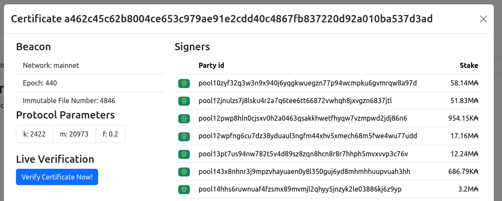
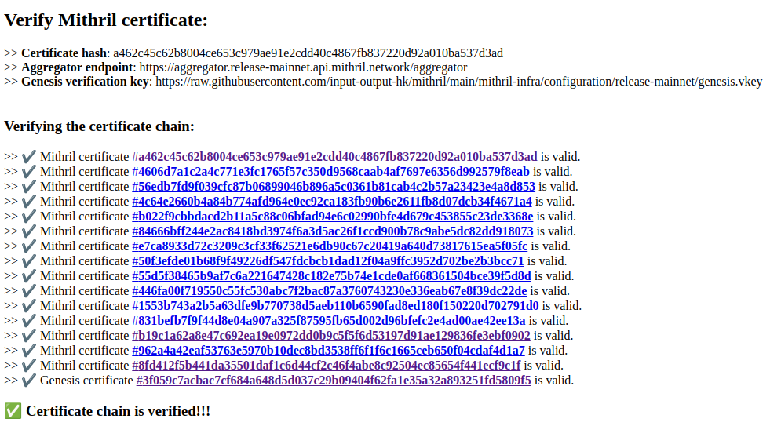

# Run the PoC for Mithril client in the browser with WASM

## Installation
- Install a correctly configured Rust toolchain (latest stable version). You can follow the instructions provided [here](https://www.rust-lang.org/learn/get-started).

- Install Rust WASM Pack:
```bash
cargo install wasm-pack
```

- Install **clang**:
```bash
sudo apt install clang
```

- Install `nodejs` version `12.22+`
```bash
sudo apt install nodejs
```

- Install `npm` version `8.11+`
```bash
sudo apt install npm
```

:warning: If you have troubles building the `BLST` library, you will need to:
- Install [`Emscripten`](https://emscripten.org/docs/getting_started/downloads.html)
- For macOS users, consider reading this [guide](https://github.com/emscripten-core/emscripten/issues/5696) to activate the `emcc` command
- Use these environment variables to use this compiler (or prefix all following commands with them):
```bash
export CC=emcc
export AR=emar
```

## Build WASM package

Go to the `poc_wasm_client` directory:
```bash
cd poc_wasm_client
```

Then you can build the WASM package:
```bash
wasm-pack build
```
## Build and serve Mithril Client Poc in WASM

First install the packages:
```bash
npm install
```

Then, build and serve:
```bash
npm run serve
```

## Build and serve the explorer
In a new terminal, go to the explorer directory:
```bash
cd mithril-explorer
```

Install the explorer:
```bash
make install
```

And serve the explorer:
```bash
make serve
```

Open [http://localhost:3000](http://localhost:3000/explorer) with your browser.

In the **Certificate** modal a new button **Verify Certificate Now!** is available in the **Live Verification** section:


By clicking on this button, you will open a new page that will verify the corresponding certificate!
